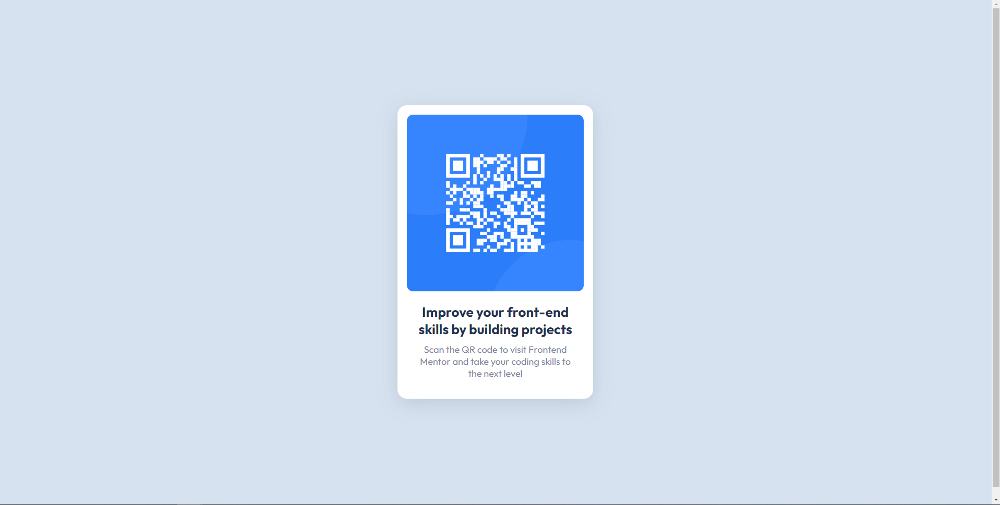
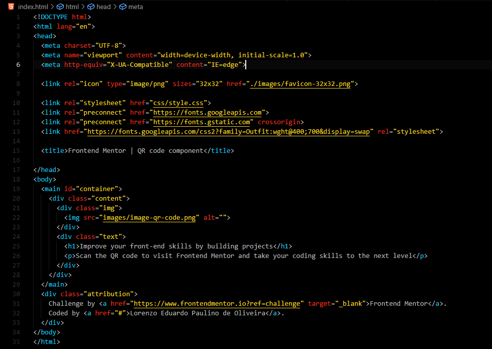
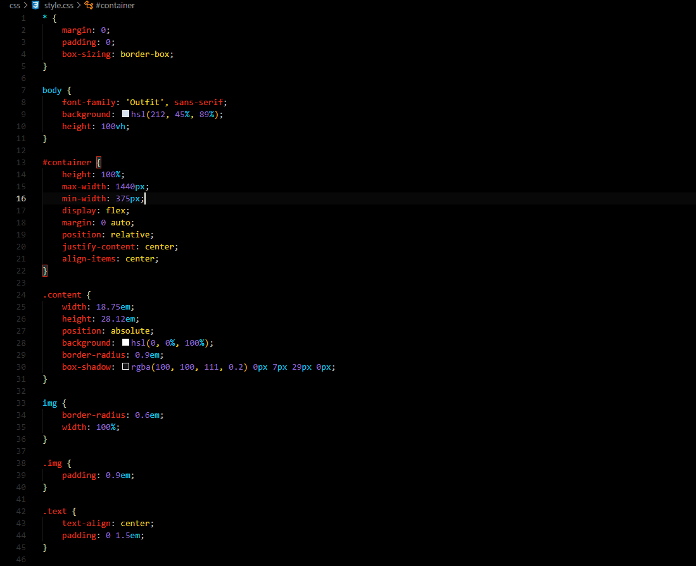
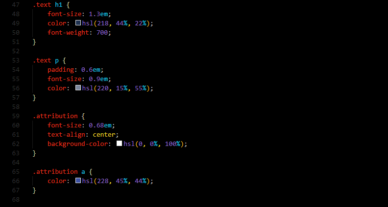

# Frontend Mentor - QR code component solution

This is a solution to the [QR code component challenge on Frontend Mentor](https://www.frontendmentor.io/challenges/qr-code-component-iux_sIO_H). Frontend Mentor challenges help you improve your coding skills by building realistic projects. 

<h1>QR Code Component</h1> 

<p align="center">
  
  
   
</p>

> Status do Projeto: :heavy_check_mark:  (concluido)

### Table of contents

- [Description of the project](#description-of-the-project)
  - [Deploy da Aplicação](#layout-or-deploy)
  - [Screenshot](#screenshot)
  - [Links](#links)
- [My process](#my-process)
  - [Built with](#built-with)
  - [What I learned](#what-i-learned)
  - [Useful resources](#useful-resources)
- [Author](#author)


## Description of the project 

<p align="justify">
  Neste projeto eu recriei um cartão qr code seguindo o desafio do front-end mentor tentando deixar o cartao o mais parecido possivel com o cartao amostra.
</p>

### Layout or Deploy

> https://qr-code-trial-frontendmentor.netlify.app/

### Screenshot






### Links

- Solution URL: [Solução URL](https://lorenzopvoid.github.io/qr-code-component/)
- Live Site URL: [Netlify URL](https://qr-code-trial-frontendmentor.netlify.app/)

## My process

### Built with

- Semantic HTML5 markup
- CSS custom properties

### What I learned

Criei primeiramente o <main> onde coloquei um id #container para começar a divisao do conteudo, dentro do main eu criei um uma <div> que corresponde ao conteudo do cartao que foi centralizado no centro do viewport sendo assim:

```html
<main id="container">
  <div class="content">
  </div>
</main>
```
dentro do content criei uma <div> para guardar a imagem QR, e em seguida outra <div> para todo o conteudo de texto do cartao:

```html
<main id="container">
  <div class="content">
    <div class="img">
    </div>
    <div class="text">
    </div>
  </div>
</main>
```
tendo o separado o conteudo do cartao, parti para a ediçao do codigo css.

a primeira tarefa foi resetar o conteudo da pagina, sendo assim  

```css
*{
  margin: 0;
  padding: 0;
}
```

tendo feito isso eu comecei trabalhando com o <body> colocando uma fonte de texto estilizada como mostrado no design amostra do desafio, e instaurando a cor azul clara no background do documento e altura do viewport.

```css
body {
    font-family: 'Outfit', sans-serif;
    background: hsl(212, 45%, 89%);
    height: 100vh;
}
```

Para o container eu coloquei uma altura de 100%, coloquei largura maxima e minima, para que nao passasse dos padroes exigidos pelo desafio, usei o justify-content e align-itens para centralizar o conteudo no centro da pagina, e a margin: 0 auto; para que a margem ficasse igual dos dois lados.

Pude partir para o conteudo do cartao(content), inicialmente comecei atribuindo uma altura e largura que achei semelhante a do design do desafio, mudei a unidade de medida de px para em, e defini a posiçao do cartao como absoluta, definindo a posiçao relativa no container. O background do cartao(content) foi definido como branco, e tambem coloquei um arredondamento nas bordas do cartao(content). Como um plus coloquei um sombreamento no cartao para dar uma impressao de sobreposiçao com o container, dando a impressao que ele está posicionado acima do container.

Quando terminei com o content(cartao), fui formatar a imagem do QR code, primeiro tentei definir todas as medidas na propria imagem e nao consegui adicionar um padding diretamente na imagem, apenas a largura e arredondamento nas bordas da mesma ficando assim:

```css
img {
    border-radius: 0.6em;
    width: 100%;
}

.img {
    padding: 0.9em;
}
```

A classe foi adicionada na <div> em que se encontrava a imagem, adicionando assim o padding que estava faltando. Nao foi necessario centralizar a imagem no centro do cartao pois o proprio padding e a largura definida como 100% ja haviam resolvido esse problema.

Seguindo para formataçao do texto que estava no conteudo, adicionei uma classe "text" na <div> que continha os textos, usando essa classe para alinhar ambos os textos no centro do cartao(content) e colocar um padding nos textos sendo assim: 

```css
.text {
    text-align: center;
    padding: 0 1.5em;
}
```

Ajustei o tamanho da fonte do <h1> como tambem adicionei a cor e font-weigth (que pode ser dispensado). Após o <h1> formatei a ultima parte que era o paragrafo, coloquei o tamanho de fonte e cor indicados convertendo o tamanho da fonte de px para em como feito em todo o decorrer do projeto, e tambem coloquei um padding adicional para ficar mais parecido como o design do desafio.

```css
.text p {
    padding: 0.6em;
    font-size: 0.9em;
    color: hsl(220, 15%, 55%);
}
```

### Useful resources

- [Conversor de unidade de medidas utilizado](https://www.w3schools.com/tags/ref_pxtoemconversion.asp) - O W3Schools me ajudou na conversão das medidas de px para em.
- [Fonts Google](https://fonts.google.com/specimen/Outfit) - Site usado para formatação da fonte do projeto.

## Author

- Github - [Lorenzo E. Paulino de Oliveira](https://github.com/lorenzopVoid)
- Frontend Mentor - [@lorenzopVoid](https://www.frontendmentor.io/profile/lorenzopVoid)
- [<br><sub>Lorenzo Eduardo</sub>](https://github.com/lorenzopVoid)

